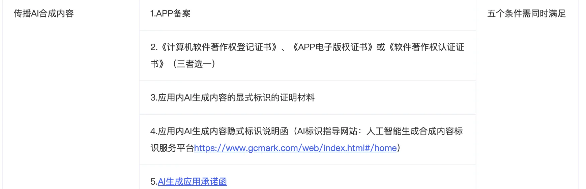
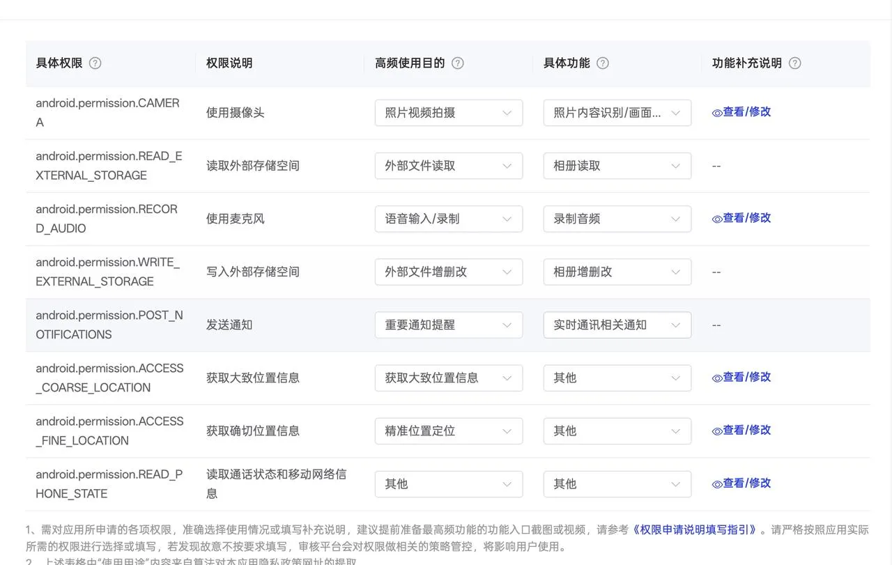
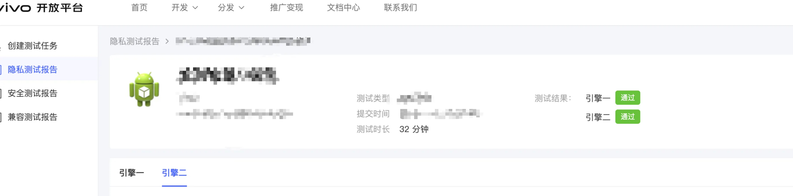
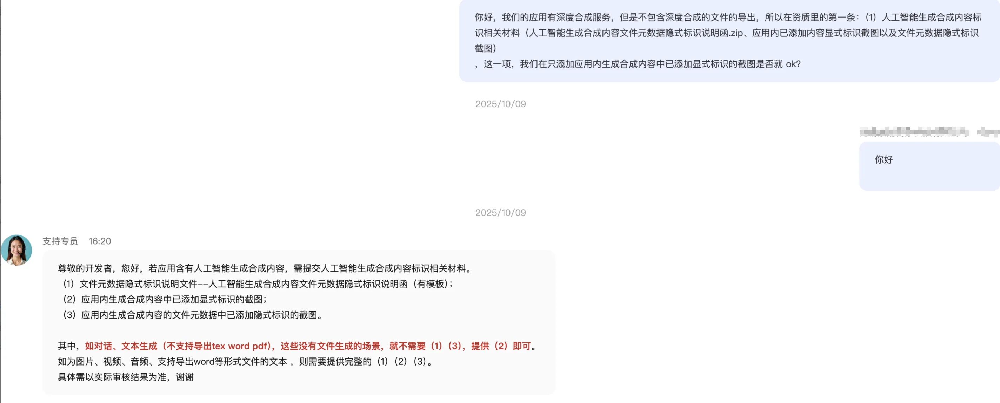
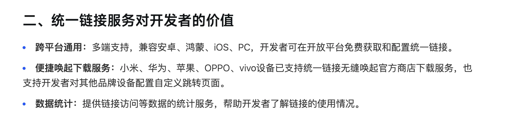

这里主要是记录当前上架各平台的时候的一些审核反馈，涉及：小米、华为、Apple、vivo、OPPO、荣耀

为了给大家一些功能的参考性，会从功能与解决方法两个方面来写，区分平台。

## 不区分平台的踩坑记录：

1. 测试账号备注：

   1. 利用好这个备注，可以补充测试账号信息，业务的流程，一些测试数据案例，还有添加备注，比如你修改了某某配置，需要同步审核人员
   2. 需要登录后才能查看的 app，一定要填写测试账号信息，否则，就会驳回如下：应用内未提供免费试用的功能或未提供可用于测试完整功能的测试账号（应用已禁止注册新用户 无法进行注册登录）；

2. icon 尺寸

   1. 一定按要求提交
   2. 如果 app 安装到桌面后，icon 有拉伸，会被驳回

3. 如何修改 Android 的签名

   1. 大部分厂家都支持修改，前提是没有上架，跟客服沟通即可
   2. 上架后的应用，小米是要删除重建，数据是保留的。
   3. vivo 与 OPPO，荣耀等等都是需要提交工单，沟通 ok 之后，然后再提审，就可以修改成功
   4. 沟通工单的时候，请合理说明理由即可，没有被卡住
   5. 华为、荣耀，审核人员说未上架的应用可以提交新版本来修改

4. 您的应用隐私政策未以明示同意的方式征得用户同意，如进入注册登录页面，隐私政策勾选框默认勾选同意/隐私政策无勾选框，“登录即代表同意”，不符合应用市场审核标准。请定位修改，确保应用内的隐私政策有提供用户主动勾选的空白复选框，不得默认勾选或同意。——背景是，我们启动之后，弹窗提示用户是否同意一系列协议，用户点击同意进入了登录页，此刻我们的用户协议的勾选框随着勾选了，于是被判断违规。
5. 需要注册才能使用的应用，要开发账号密码登录功能（这条建议只供参考）

# OPPO

## 1.其他平台同步问题——资质材料不能同步，需单独提交

【驳回原因】:您的应用内含有 AI 深度合成/生成式人工智能服务，此类应用还需提供大模型、算法类承诺函； 【整改建议】:承诺函模板：[https://open.oppomobile.com/new/developmentDoc/info?id=10005](https://open.oppomobile.com/new/developmentDoc/info?id=10005)；请加盖有效的公章，同时请将承诺函上传至【版权证明】处或打包压缩上传至【特殊类证书】处。

### 解决方案：

1. 此问题的前提是 OPPO 这边的资质材料不全，并且从其他平台比如小米，同步更新 apk ，暴露了问题，因为目前 OPPO 平台上未上传 OPPO 平台内部的【承诺函】，需要单独上传盖章后的承诺函，再次提交即可。

## 2.2025 年 9 月 1 日开始执行新规——开发 AI 提示的功能



### 解决方案：

1. 开发 AI 提示的功能
2. 补充应用内 AI 生成内容的显式标识的证明材料
3. 签署承诺函

## 3.上架时权限必填问题



### 解决方案：

按要求填写即可，基本不会卡，特殊权限除外，上述权限的配置供学习参考

---

# 小米

## 1.隐私合规检测没有通过

【驳回原因】:识别到 APP 内「存在隐私违规问题」该 APK 有 3 家引擎检测不通过，请根据下方检测详情进行整改。

APP 以个人信息处理规则隐私政策弹窗等形式向用户明示个人信息处理的目的、方式和范围，未经用户同意，（SDK：FaceBookReact）存在收集（读取特定类型传感器列表）的行为。

我们的业务背景是使用了一个极光推送，没有对接好，就出现了【同意用户协议与获取设备信息用于极光推送的时序问题】，隐私政策也没有与 sdk 完全一致

### 解决方案：

1. 更新隐私政策说明等等
2. 先同意用户协议，再获取设备信息用于极光推送
3. 如何验证，修改成功了？小 tips：修改后，重新打包一版去 vivo 的开放平台，那里支持隐私自检（这个羊毛可以薅哈哈）地址：[https://dev.vivo.com.cn/vcl/#/auto-test/privacy-report/list](https://dev.vivo.com.cn/vcl/#/auto-test/privacy-report/list)

## 2.小米的商店链接

上架之后，发现小米商店发布的 app 的分享链接不能用，只能使用统一链接哦

---

# 荣耀

## 1.注意提交的商店截图——您的应用截图含测试信息描述，请修改您的应用信息后重新提交。

## 2.安卓联盟同步问题

节假日提审其他平台，荣耀一直没有同步。


上面是入库成功的，下面是入库失败的。建议 3 天没有收到类似上面的荣耀的入库通知，就单独提审荣耀吧。


# vivo

## 1.审核比较严谨，会使用功能

为数不多的，会注册账号登录的审核团队，然后也会使用功能，有时候会反馈我们某个功能不能用，其实是我们的功能 bug

## 2.审核速度巨快，比 OPPO 还快，最新记录是 30 mins

---

# Apple

## Guideline 2.5.2 - Performance - Software Requirements

\*\*The app installed or launched executable code. Specifically, the app uses the itms-services URL scheme to connect to xxx , which may allow for installations or updating of the app.

Next Steps

- **Remove any reference to \*\***itms-services URL\*\* schemes from the app.
- Learn more about software requirements in guideline 2.5.2.
- Revise the app to comply with these requirements.
- Once the app is fully compliant, resubmit the app for review.

实则是提交的版本里，有蒲公英的检查版本更新，跳转的功能，这个是我们开发与测试环境有的功能，在提交生产之后没有去掉。后面我们在页面去掉了这个功能，但是代码里没有完全删除，再后期上架推进的时候又反馈了这个问题，所以一定要在代码里

删除干净，达到在编译时，提交的 IPA 的代码里，都没有蒲公英的 API 的一些字段，比如什么 PGYER_API_KEY 都不能有哦。我甚至还为此写了一个脚本，专门检验打包后的东西是否还有蒲公英的相关字段：如下：

```plain
#!/bin/bash

# 验证生产构建中是否包含蒲公英相关代码
# 用法: ./scripts/verify-production-build.sh [ipa文件路径]

set -e

# 颜色定义
RED='\033[0;31m'
GREEN='\033[0;32m'
YELLOW='\033[1;33m'
NC='\033[0m' # No Color

echo "========================================="
echo "验证生产构建 - 检查蒲公英相关代码"
echo "========================================="
echo ""

# 确定 IPA 文件路径
if [ -z "$1" ]; then
    IPA_FILE="build/ipa/AI-production.ipa"
else
    IPA_FILE="$1"
fi

if [ ! -f "$IPA_FILE" ]; then
    echo -e "${RED}❌ 错误: 找不到 IPA 文件: $IPA_FILE${NC}"
    echo "请先构建生产版本: npm run build:ios:production"
    exit 1
fi

echo "📦 检查文件: $IPA_FILE"
echo ""

# 创建临时目录
TEMP_DIR="build/temp_verify_$(date +%s)"
mkdir -p "$TEMP_DIR"

echo "⏳ 解压 IPA 文件..."
unzip -q "$IPA_FILE" -d "$TEMP_DIR"

echo "✅ 解压完成"
echo ""

# 查找 .app 包
APP_PATH=$(find "$TEMP_DIR" -name "*.app" -type d | head -1)

if [ -z "$APP_PATH" ]; then
    echo -e "${RED}❌ 错误: 找不到 .app 包${NC}"
    rm -rf "$TEMP_DIR"
    exit 1
fi

echo "📱 应用路径: $APP_PATH"
echo ""

# 检查项
ERRORS=0

echo "========================================="
echo "开始检查..."
echo "========================================="
echo ""

# 1. 检查 itms-services
echo "1️⃣  检查 itms-services URL scheme..."
if strings "$APP_PATH/AI" | grep -qi "itms-services"; then
    echo -e "${RED}   ❌ 发现 itms-services 字符串！${NC}"
    strings "$APP_PATH/AI" | grep -i "itms-services"
    ERRORS=$((ERRORS + 1))
else
    echo -e "${GREEN}   ✅ 未发现 itms-services${NC}"
fi
echo ""

# 2. 检查蒲公英 API URL
echo "2️⃣  检查蒲公英 API URL..."
if grep -r -i "api.pgyer.com" "$TEMP_DIR/"; then
    echo -e "${RED}   ❌ 发现蒲公英 API URL！${NC}"
    ERRORS=$((ERRORS + 1))
else
    echo -e "${GREEN}   ✅ 未发现蒲公英 API URL${NC}"
fi
echo ""

# 3. 检查蒲公英分发链接
echo "3️⃣  检查蒲公英分发链接..."
if grep -r -i "www.pgyer.com" "$TEMP_DIR/"; then
    echo -e "${RED}   ❌ 发现蒲公英分发链接！${NC}"
    ERRORS=$((ERRORS + 1))
else
    echo -e "${GREEN}   ✅ 未发现蒲公英分发链接${NC}"
fi
echo ""

# 4. 检查二进制文件中的蒲公英字符串
echo "4️⃣  检查二进制中的 pgyer 字符串..."
if strings "$APP_PATH/AI" | grep -qi "pgyer"; then
    echo -e "${YELLOW}   ⚠️  发现 pgyer 字符串（可能是注释或日志）${NC}"
    strings "$APP_PATH/AI" | grep -i "pgyer" | head -5
    echo "   请手动检查这些字符串是否可接受"
else
    echo -e "${GREEN}   ✅ 未发现 pgyer 字符串${NC}"
fi
echo ""

# 5. 检查 Info.plist
echo "5️⃣  检查 Info.plist 配置..."
if grep -i "itms-services" "$APP_PATH/Info.plist" 2>/dev/null; then
    echo -e "${RED}   ❌ Info.plist 中发现 itms-services！${NC}"
    ERRORS=$((ERRORS + 1))
else
    echo -e "${GREEN}   ✅ Info.plist 干净${NC}"
fi
echo ""

# 清理
echo "🧹 清理临时文件..."
rm -rf "$TEMP_DIR"

echo ""
echo "========================================="
echo "检查完成"
echo "========================================="
echo ""

if [ $ERRORS -eq 0 ]; then
    echo -e "${GREEN}🎉 恭喜！所有检查通过，可以提交到 App Store${NC}"
    echo ""
    echo "后续步骤:"
    echo "1. 使用 Transporter 上传 IPA 到 App Store Connect"
    echo "2. 提交审核"
    echo "3. 如果 Apple 再次拒绝，请提供本次检查的结果"
    exit 0
else
    echo -e "${RED}❌ 发现 $ERRORS 个问题，请修复后重新构建${NC}"
    echo ""
    echo "可能的原因:"
    echo "1. 使用了错误的环境配置构建（不是 production）"
    echo "2. 代码中仍有硬编码的蒲公英 URL"
    echo "3. 依赖库中包含相关代码"
    echo ""
    echo "请检查 docs/APPLE_REVIEW_PGYER_FIX.md 了解解决方案"
    exit 1
fi
```

## Guideline 2.1 - Information Needed

We are unable to successfully access all or part of the app. In order to continue the review, we need to have a way to verify all app features and functionality for all account types. Typically this is done by providing a demo account that has access to all features and functionality in the app.

Next Steps

To resolve this issue, provide a user name and password in the App Review Information section of App Store Connect. It is also acceptable to include a demonstration mode that exhibits the app’s full features and functionality. Note that providing a demo video showing the app in use is not sufficient to continue the review.

如果是需要登录的 APP，一定要给账号密码，如果是手机号验证码登录的 app，需要开发账号密码登录，账号注册功能。实践中发现，我们一开始只有手机号验证码登录，听说审核人员是使用没有卡的设备去审核的，不会去注册。然后如果只开发账号密码登录，不开发账号注册功能，又会以流程不完整被驳回。具体的审核反馈，看每个应用的情况，我们是这样的一个流程，所以我们一开始被卡住之后，很久都没有提审，开发完了登录、注册流程之后才继续提审。

## Guideline 2.3.3 - Performance - Accurate Metadata

Issue Description

The 13-inch iPad screenshots do not show the actual app in use in the majority of the screenshots.

Screenshots should highlight the app's core concept to help users understand the app’s functionality and value.

Next Steps

Upload new screenshots that resolve the issues identified above and accurately reflect the app in use on each of the supported devices.

因为没有开发 iPad 适配，但是代码里把 iPad 的配置勾选上了（怪我当时手贱），而且我一段时间之后我都忘记了我开了这个配置……导致每次变化功能都要更新截图，当时我都没有想起来去关掉这个配置。反馈的意思是不能 只用启动页作为截图 。

## Guideline 5.1.1 - Legal - Privacy - Data Collection and Storage

### 问题一：

Issue Description

One or more purpose strings in the app do not sufficiently explain the use of protected resources.

Purpose strings must clearly and completely describe the app's use of data and, in most cases, provide an example of how the data will be used.

Next Steps

Update the camera and photo library purpose string to explain how the app will use the requested information and provide a specific example of how the data will be used.

See the attached screenshot.

Resources

Purpose strings must clearly describe how an app uses the ability, data, or resource. The following are hypothetical examples of unclear purpose strings that would not pass review:

- "App would like to access your Contacts"
- "App needs microphone access"

**See examples of **[helpful, informative purpose strings](https://developer.apple.com/design/human-interface-guidelines/privacy#Requesting-permission).

更新相机和照片库用途字符串，以解释应用程序将如何使用所请求的信息，并提供如何使用数据的具体示例。目的字符串必须清晰完整地描述应用程序对数据的使用，并且在大多数情况下，提供数据将如何使用的示例。

相机与照片库的权限申请时的描述字符例如：

1. `<span class="ne-text">NSCameraUsageDescription</span>` - 相机权限描述：例如——我们需要访问相机来帮助您拍摄个人资料照片和分享社区动态
2. `<span class="ne-text">NSPhotoLibraryUsageDescription</span>` - 照片库权限描述：例如——允许访问照片库以便您选择图片设置为头像，并分享照片到社区与好友互动

### 问题二：

The app does not meet all requirements for apps that offer highly regulated services or handle sensitive user data. Specifically:

- The app must be published under a seller and company name that is associated with the organization or company providing the services. In this case, the app must be published under a seller name and company name that reflects the XX name.

**The **[guideline 5.1.1(ix) requirements](https://developer.apple.com/app-store/review/guidelines/#data-collection-and-storage) give users confidence that apps operating in highly regulated fields or that require sensitive user information are qualified to provide these services and will responsibly manage their data.

这个问题更奇葩，我们的组织名称是英文，是因为在申请的时候必须英文，而我们的应用名称是中文，就提示了这个。

我们跟审核沟通：
你好，我们看到您驳回的信息，我们理解你的顾虑。我们在注册 Apple 开发者账号时，需要注册组织时提供邓白氏编码，但是我们在注册邓白氏编码时必须提供英文的名称，所以使用了这个名称作为组织名，实则我们的运营主体是中文的“XXX 公司”
下面是我们的官网地址：XXX
你可以切换语音来查看我们是同一个公司。 如果需要，我们可以提供注册邓白氏编码时提供的公司信息。

## Guideline 1.4.1 - Safety - Physical Harm

** The app includes medical information but does not include citations for the medical information. Specifically, the app provides health or medical wellness reports in the app without citations, such as links to sources for this information. All apps with medical and health information should include citations to ensure users are provided accurate information. Next Steps Include citations in the app of the sources of the recommendations or information, such as links to those sources. The citations to the sources should be easy for the user to find. Resources Learn more about requirements for medical apps in **[guideline 1.4.1](https://developer.apple.com/app-store/review/guidelines/#physical-harm).

涉及 AI 大模型回复文字的引用功能，审核人员觉得我们的引用不规范，不标准，需要与我们电话沟通，我们回复邮件申请中文+邮件沟通，不同意，最后就等电话。后来持续大概两周才顺利联系到审核人员，因为有时差，然后打电话我们接到之后，还听不到那边的声音，最后简单沟通了一下，就知道问题在哪，还是引用的来源与频率的问题，我们修复之后，就通过审核了。

## Guideline 2.5.4 - Performance - Software Requirements

** The app declares support for audio in the UIBackgroundModes key in your Info.plist but we are unable to locate any features that require persistent audio. Background audio is intended for use by apps that provide audible content to the user while in the background, such as music player, music creation, or streaming audio apps. Next Steps If the app has a feature that requires persistent audio, reply to this message and let us know how to locate this feature. If the app does not have a feature that requires persistent audio, it would be appropriate to remove the "audio" setting from the UIBackgroundModes key. Resources - Learn more about software requirements in **[guideline 2.5.4](https://developer.apple.com/app-store/review/guidelines/#software-requirements). - Review documentation for the [UIBackgroundModes key](https://developer.apple.com/documentation/bundleresources/information_property_list/uibackgroundmodes).

这个是功能问题导致的，因为有视频通话功能，它 app 审核时无法验证，因为没有人打电话，所以我们录制了一个测试视频，就通过了。如果急着上架，最好要考虑好这种情况，比如 vivo（还是 OPPO ？记不清了） 审核就因为一个聊天室功能，审核发消息的时候没有消息回应而驳回审核。

## 不及时签署协议，会一会处于等待审核中

协议一更新，如果开发者未签署，就不会审核，有时候，你都不知道协议又变更了

---

# 华为

## 人工智能应用——必须有举报功能

您的应用内含深度合成或生成式人工智能服务内容，未提供举报功能，不符合相关法律法规要求。

修改建议：请在应用内提供公开透明无障碍的举报功能/设置举报制度/提供举报途径，以便您及时处理公众投诉举报。

您可参考《审核指南》第 12 章节：https://developer.huawei.com/consumer/cn/doc/app/50115#h1-1691639693501-0

### 解决方案：

这个有一定的时间跨度，上半年时提交是正常的，下半年突然反馈这个问题，应该是新规导致的，之前我们的 AI 回复消息只有在页面有一个入口【反馈】，但是反馈不合规了，所以改成了现在的大模型应用的聊天消息的样子。

## 隐私政策问题——要反复对照

2.您应用内的隐私政策/在 AppGallery Connect 上提交的隐私政策未向用户突出明示处理的敏感信息，不符合相关法律法规要求。

修改建议：请您在隐私政策中以字体加粗、增大字号、醒目颜色等方式突出展示 APP 处理的个人敏感信息。

您可参考《审核指南》第 7.2 项：https://developer.huawei.com/consumer/cn/doc/app/50104-07#h3-1683701612940-0

**常见个人敏感信息包括但不限于如身份证号码、面部识别特征、银行账号、网页浏览信息、不满十四周岁未成年人的个人信息等，详情可参考《GB/T 35273-2020 信息安全技术 个人信息安全规范》附录 B：http://c.gb688.cn/bzgk/gb/showGb?type=online&hcno=4568F276E0F8346EB0FBA097AA0CE05E**

APP 常见个人信息保护问题 FAQ 请参考：

https://developer.huawei.com/consumer/cn/doc/app/FAQ-faq-01#h1-1698326268221-0

## 人工智能应用需要的资质——如果不涉及文件生成就不需要全部的材料



## 不符合业务合规性——最难解决，目前依旧没有解决

需要排查业务，但是其他平台都过了的情况下，也不知道如何排查了。我们也更新过签名，重新提审，还是反馈这个问题。无解，如果有知道的小伙伴可以提一些建议，感谢！

---

# 各开放平台的上架体验红黑榜测评

## 红榜：

### 1.vivo：

- 响应速度快，最快记录是一小时内，至今没有其他平台能打破
- 审核仔细，是少数会使用我家功能的审核平台，比如会发一些政治敏感的词语测试我们的聊天功能是否正常（特意开发了这个过滤呢，辛辛苦苦开发的功能，终于被看见的感觉，泪目）
- **今年收到了他们家的问卷，**让我们反馈开放平台的使用反馈，被重视的感觉，值得夸赞，其实我真的没有啥感觉，因为他们家存在感真不强，只感觉到了快哈哈，他们生态啥的都没有注意到
- 春节前， 收到了他们的放假通知！良心！为我们的产品迭代提供了参考！狠狠夸赞。
- 提工单反馈超级快，不过夜

### 2.小米：

- 客服给反馈很快，很仔细，上班时间虽然短，但是邮件的响应也蛮快，能帮忙解决问题
- 审核规范写的很仔细，是可以用来做参考的程度，政策同步也是差不多最快的，今年有几次规范的修订，都被通知到了
- 推送服务开通的时候，也给支持开通了测试的推送，效率高
- 统一链接蛮不错

### 3.OPPO

- 统一链接是加分项，以前都没有注意到这个功能，最近感觉好好用
- 审核很快，同步其他平台也快
- 提工单反馈也超级快，甚至不过夜就反馈了！

## 黄榜：

### Apple：

- 要求比较多，要求比较严格，要求的与 Android 系统不一样
- 没有应用的分类，所以每一个类别的审核规范，在前期提交上架的时候，都没有办法很好的进行，不过虽然文档不是很详细，沟通不便，但是沟通蛮积极！
- 而且可以要求他们直接帮你审核通过，如果是遇到他们理解问题的话，而不是自己再手动提交审核。懂这个的人都知道我在说什么
- 日常是 2 天审核时间，没有国内 Android 的那几家快，但是也蛮快的
- 审核进度通知的邮件不是百分百推送，所以需要自己盯着一点

## 黑榜：

### 1.华为

- 审核慢
- 反馈不仔细
- 提工单反馈也超级慢，大概一周才能结束一个工单，每次回复都是挤牙膏一样，然后也不给正面回复
- 推送服务的开通超级难开通
- 填写 app 更新时，需要先上传软件包，然后在管理软件包，再提交，比其他管理平台难用
- 反馈时，与工单一样，没有积极反馈，并且工单，很容易就被关闭
- 为啥你不加入安卓联盟？

### 2.荣耀

- 高贵的荣耀，为啥不开通【统一链接】？
- 它的优点是比华为的界面流程简洁一点点，它的缺点是，与华为一样，效率低下，解决问题难
- 提交工单与华为一样难用
- 审核慢，有几次从其他平台同步 app 的时候，都是最后一个同步的，然后节假日的时候，还遇到节后都没有入库成功的情况，节后手动提交的……

ok，以上是 2025 年我的 app 上架的一些个人采购记录，仅供参考，如有帮助，记得点赞收藏～

最后，华为一直没有通过我们的 app 上架，如果有小伙伴有经验，可以给我提一些建议，感谢！
