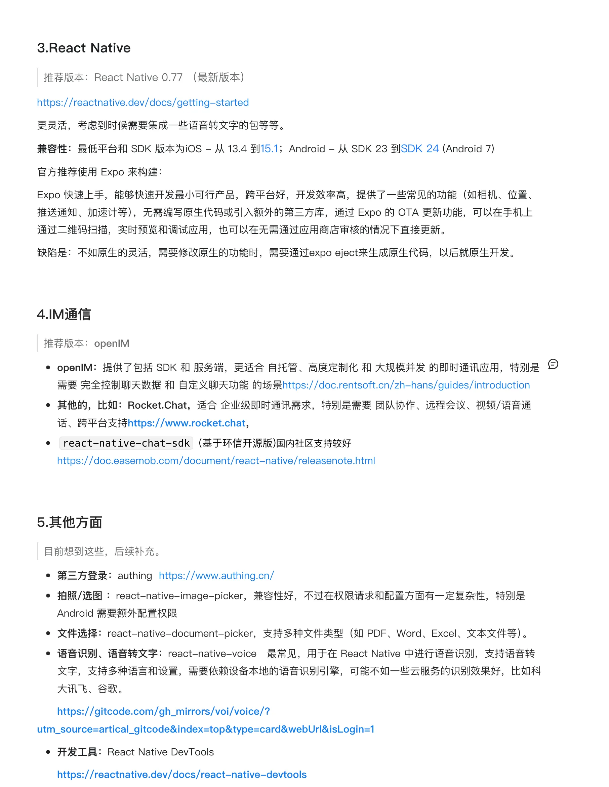

# 一、2025 年初，跳槽了

2025 春节假期结束后入职了一家初创公司，来之前以为团队还有其他前端，没有想到的是：这个项目里，我是第一个前端！

第一天，办入职，熟悉项目，第二天，领导说：“我们要做医疗类 App，你来选框架。”

那一刻我是真麻了，虽然我想在技术实践上有更多自主选择权，但是也没有想到一来就是独挑大梁！

入职前知道技术栈可能是 React，而我是写了三年的 Vue，项目是 Web 端居多，只偶尔写过 Uni-app 与 H5 ，我对于 Vue 那是十分的熟练，起新项目也手到擒来。入职的时候打着能扩展项目经历的想法，我觉得转成 React 项目，也是一个加分的经历，说实在的，我当时的 React 水平也只是浅学一下下，有一两个浅浅的项目实战经验。

# 二、关于 APP 开发

说回正题，开发 APP，并且选型，对于干了三年 web 前端的我，真是天方夜谭。

我？APP？

我努力找我与它的关联，翻来覆去，想到 2 个：

1. 我只在大学上过 Android 的课，成绩还不错
2. 大学参与课题的时候，自己开发过一个 Flutter 的 APP，还没有开发结束，临近毕业，不想写了，那个项目反正也是为了参加竞赛使用的，不刻意回想，我都快想不起来这回事了。

但不论怎么样，我还是要去调研，选型。

我那时候乐观的想，反正我就去网上查嘛，网上都有行业经验的，照抄就行。

查来查去，我就决定在 Uni-app,React Native, Flutter 里面三选一。（不考虑原生，看当时我们团队的进度紧急情况，根本没有空写原生吧，而且现在原生的开发者应该没有混合端的多，不是有一个数据，Apple App Store 美国区 Top 100 超过三分之二的头部 App 都不是纯原生开发，那我更没有必要吧，上学的时候老师都说，原生开发就业窄。）

# 三、既来之，那就硬着头皮选吧

当前的我，查了很多网站帖子，问了很多 AI，这里还有我的当前的一些记录：

我也不具体分析三者的详细区别了，这些问 AI 更准确，只是从我们的项目与我个人的情况来讨论：
医疗类 app，其实很多时候，都要有这些功能：文件上传，相机，语音转文字，即时聊天等等。

相机这个功能，让我想起去年用 Uni-App 做相机的痛苦回忆：

Uni-App 相机本质：WebView + 原生插件桥接，有很多兼容问题，还有卡顿情况，并且如果是复杂交互基本开发难度加倍，甚至很多场景功能都是要自己定制呢。不过 uniapp 的好处也很明显——丝滑转换小程序，h5，生态好，发展快，上手更快，现在国内用这个开发的人也越来越多了。

React Native 好处也很多的，比如：更新稳定，开源插件多，Expo 出现后，开发难度变低了，然后国外的使用者蛮多的，国内招人也比 Flutter 好招，**医疗项目一般 5 年起步**，项目的维护难度，我认为比 uniapp 更友好。再加上，医疗行业的特殊考量，轻量医疗应用（挂号、查询）可能用 Uni-App。但全流程平台（问诊、病历管理）多用 RN 或原生，原因：性能要求更高，扩展性需求更强，如果项目发展好的话，未来肯定有各种定制需求。

当然在做决策，我也有自己的小心思，我想多扩展自己的项目经历，我觉得 uniapp 没有 React native 值钱，所以倾向 RN。哈哈哈，现在回想，这个想法真是比较天真，傻不愣登的，值钱的不是技术，是解决问题的能力来着。
还有，问 AI 建议的时候，我发现一个没人说但很重要的理由：思维连续性。我不想其他项目用 React 写的时候，我还要去跳思维去写 Uniapp，思维转来转去，很烦人，虽然 React 与 React Native 的相似度并不是特别高。

# 四、理性分析：三个框架的对比

抛开个人情绪，我做了张对比表。

| 维度       | Uni-App          | React Native     | Flutter    | 医疗权重                                                                              |
| ---------- | ---------------- | ---------------- | ---------- | ------------------------------------------------------------------------------------- |
| 学习成本   | 低（熟悉 Vue）   | 中（要学 React） | 高（Dart） | 中                                                                                    |
| 开发速度   | ⭐⭐⭐⭐⭐       | ⭐⭐⭐⭐         | ⭐⭐⭐     | 高                                                                                    |
| 性能体验   | ⭐⭐⭐           | ⭐⭐⭐⭐         | ⭐⭐⭐⭐⭐ | 极高（TO-C 项目，然后公司的规划蛮长远的，估计有很多医疗数据要展示，所以需要考虑性能） |
| 原生能力   | ⭐⭐（依赖插件） | ⭐⭐⭐⭐         | ⭐⭐⭐⭐⭐ | 高                                                                                    |
| 热更新     | ⭐⭐⭐           | ⭐⭐⭐⭐         | ⭐⭐       | 高                                                                                    |
| 3 年维护性 | ⭐⭐             | ⭐⭐⭐⭐         | ⭐⭐⭐     | 极高，医疗项目动不动 5-10 年起步                                                      |
| 总分       | 18⭐             | 23⭐             | 21⭐       | -                                                                                     |

这张表做完，其实也找到了答案。React Native 是综合最优解

# 五、做决策，最后一刻我要考虑的是说服自己！

上面分析的很简单，但真正执行的人是我。我得找理由，说服自己去迎接"学习一门新技术"的挑战。我给了自己的三个理由：

理由 1：技术栈的主流性。68%的头部应用都选择了跨端，我们是遵循主流的，如果选 React Native，我也算是学的是 React，学了，我不亏。选 Uni-App，我学的还是 Vue +小程序语法——这我都做过了，虽然不是很牛，但是有经验了，uniapp 的经验也难以适应于其他项目/技术

理由 2：RN 有 eject。最坏情况：如果 RN 项目真的做不下去了，我们还有两条路，让我不必为选择担责：1）逐步替换为原生模块，公司还能招原生开发者去写 2）降级为混合应用。而 Uni-App 做不下去…几乎只能重写。

理由 3：个人成长。我在赌，3 年后，React Native 经验比 Uni-App 经验更值钱。从招聘网站看，3 年 RN 经验薪资比 3 年 Uni-App 经验高。

一句话总结：选 Uni-App，我轻松，项目风险我担。选 React Native，我累，但我有成长，然后团队和项目的未来有更多扩展空间。

最后我选了 React Native。

那时候大概是入职不到一周的时候，我跟领导去汇报了这些情况，领导觉得可以，他本来也倾向于 RN 一些，而且他可能更看重与项目的持续可维护性与扩展性。

# 六、一年后，我后悔了吗？

经过一年的使用，我也从我的记忆力，拔出来 一些回忆。

中途有过不坚定，尤其在看到 Uni-app 的开发者越来越多了，社区也很热闹，有时候也会心虚

但是真正开发的时候，觉得 RN 是真的不亏是老牌技术，真的很稳定，起码一年过去了，我打包构建的东西没有出现过莫名闪退（非明显 bug）的情况，这个算是性能方面的一个好体现吧，起码我之前开发的 Uni-app ，就遇到过相机拍照，上传文件的兼容问题，打开闪退的问题。我甚至再 RN 里写过一个 js 逻辑与原生打架的代码，就这明显的 bug，竟然都能正常运行，在一般与低性能的手机上才发现 bug。

我遇到的坑，也很多，大部分是业务功能上的细节，什么 iOS 与 Android 的表现不一致了，还有 expo 的打包构建，采用了本地构建（巨坑，后面讲）。写这些内容的时候，我突然想到，有个决策可以优化一下：我应该阶段性使用云构建。开发阶段用 Expo 云构建快速迭代，上架前一个月转本地构建。这样平时开发测试，就比较快，然后上架的时候保障安全合规。但话说回来——当时的我可能做不到这个决策因为我们的项目一直处于"准备上架"的冲刺状态，开发，也就是我，没有太大的自主决定权，所以我无法跟领导要一个排期，只是在我开发的间隙里去做这个构建的任务。而且领导一直说"下个月可能上架"，结果资质审批拖了三个月。在这种不确定性下，我无法预知"上架前一个月"到底是什么时候。如果早早切到本地构建，可能浪费两个月时间；如果一直用云构建，可能临时切换来不及。所以从一开始就本地构建。虽然每次构建很累，前期去处理本地构建的东西很吃力，但从没因为构建问题耽误过进度。

这大概就是我这一年学到的最重要的知识之一：做最合适的决策，而不是最对的。

希望以上对看这篇文章，或者跟我一样面对这种困境的人有点帮助。

欢迎评论点赞收藏，之后也会更新这个系列的后续内容，包括构建的工程化，小白可以上手的上架流程等等。
